# Exercise Resource Setup

The tasks below provide instructions for creating the Azure resources required to complete all of the exercises you will perform throughout this lesson on **computer vision**.

You should follow the step-by-step instructions to provision the required resources in Azure before attempting any of the exercises. You will use your Azure subscription for creating the required resources.

> **Note**: All the Azure resource used for this exercise should be created in the same region to minimize egress charges and network latency.

- [Exercise Resource Setup](#exercise-resource-setup)
  - [Requirements](#requirements)
  - [Task 1: Create an Azure resource group](#task-1-create-an-azure-resource-group)
  - [Task 2: Provision an Azure Cognitive Services account](#task-2-provision-an-azure-cognitive-services-account)
  - [Task 3: Create a Custom Vision service](#task-3-create-a-custom-vision-service)
  - [Task 4: Create an Azure Machine Learning workspace](#task-4-create-an-azure-machine-learning-workspace)
  - [Task 5: Create a compute instance](#task-5-create-a-compute-instance)
  - [Task 6: Clone the AI Fundamentals GitHub repo on your compute instance](#task-6-clone-the-ai-fundamentals-github-repo-on-your-compute-instance)

## Requirements

- You must have an Azure subscription to complete this exercise. If you don't have one, you can sign up for a free trial at <https://azure.microsoft.com/free>.
- You will not be using a Udacity workspace to complete this exercise.

## Task 1: Create an Azure resource group

In this task, you create a resource group in Azure. Azure Resource groups provide a container for hosting and grouping Azure resources. A single resource group will be used for all exercise resources required for this lesson.

1. Open a web browser, navigate to the [Azure portal](https://portal.azure.com/), and sign in using the account associated with your Azure subscription.

2. On the home page of the Azure portal, select **Resource groups** under the Azure services heading.

    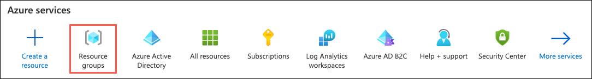

3. On the Resource groups blade, select **Add** on the toolbar to create a new resource group.

    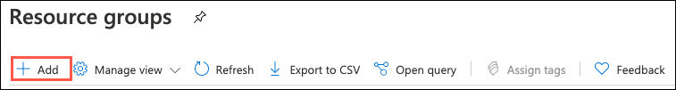

4. On the **Create a resource group** Basics tab, enter the following:

    - **Subscription**: Select the subscription you are using for this exercise.
    - **Resource group**: Enter `udacity-exercises` or another name unique within your subscription.
    - **Region**: Select any available region, but preferably one close to your location. **Note**, you will use this same region for all other resources you create during this exercise.

    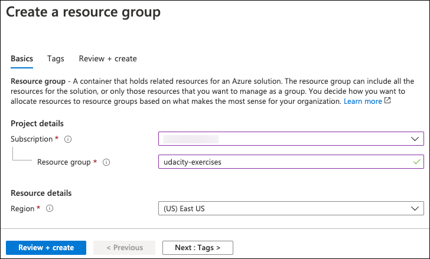

5. Select **Review + create** and on the Review + create tab, ensure the `validation passed` message is displayed and then select **Create**.

    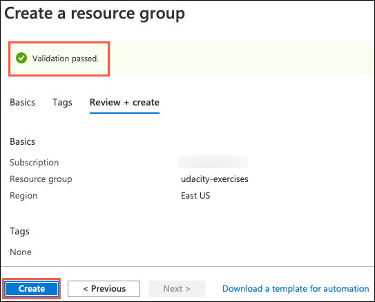

6. When the resource has been successfully created, select the notifications icon on the Azure header bar and then select **Go to resource group** in the **Resource group created** notification.

    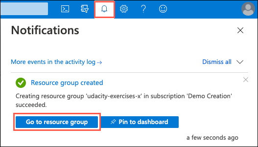

## Task 2: Provision an Azure Cognitive Services account

In this task, you create an Azure Cognitive Services account in your Azure subscription. Cognitive Services provides the majority of the computer vision capabilities you will be using throughout the exercises in this lesson.

1. On the **Resource group** blade, select **Add** on the toolbar.

    

2. Enter `Cognitive Services` into the search the marketplace box and press enter or select the result that appears below your typed text.

    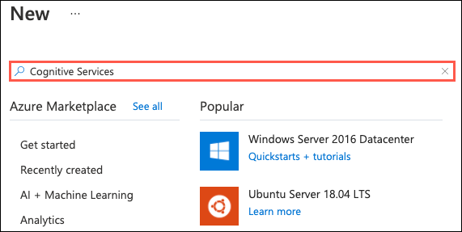

3. Select **Create** on the Cognitive Services blade.

    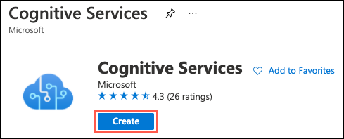

4. Configure a new **Cognitive Services** by entering the follow settings:

    - **Subscription**: Select the subscription you are using for this exercise.
    - **Resource group**: Select the resource group you create previously.
    - **Region**: Select the same region you choose for your resource group above.
    - **Name**: Enter a globally unique name, such as `udacity-cog-services-SUFFIX`, replacing `SUFFIX` with your initials or another string to make the name unique.
    - **Pricing tier**: Select **Standard S0**.

    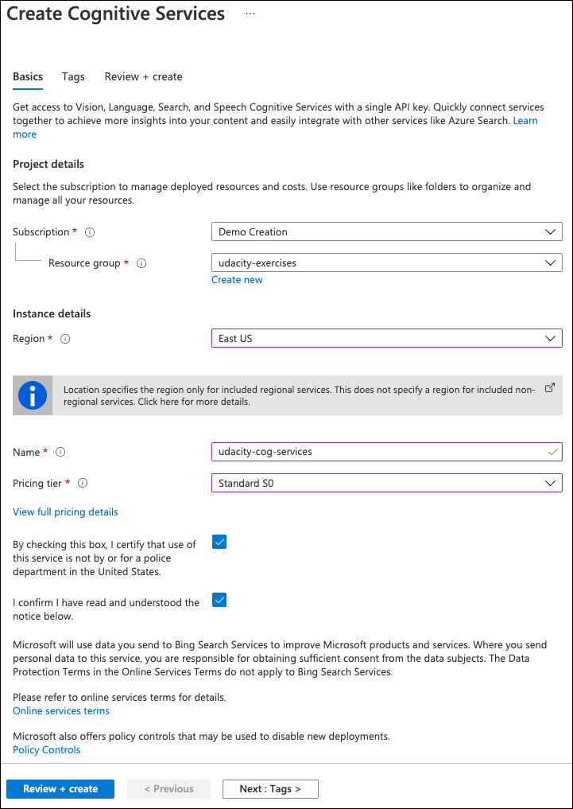

5. Select **Review + create**.

6. Ensure the validation passed and then select **Create**.

    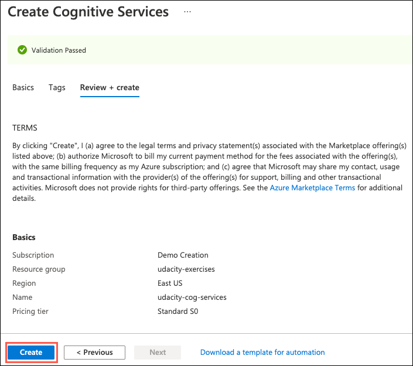

## Task 3: Create a Custom Vision service

In this task, you create a Custom Vision service in your Azure subscription. You will be using Custom Vision to create custom object detection and image classifications machine learning models.

1. Return to the `udacity-exercises` resource group blade in the Azure portal and on the **Resource group** blade, select **Add** on the toolbar.

    

2. Enter `Custom Vision` into the search the marketplace box and press enter or select the result that appears below your typed text.

3. Select **Create** on the Custom Vision blade.

    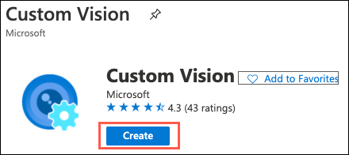

4. Configure a new **Custom Vision** by entering the follow settings:

    - **Create options**: Select **Both**. This will result in the creation of two `Cognitive Services` resources in your resource group; one for training and one for prediction.
    - **Subscription**: Select the subscription you are using for this exercise.
    - **Resource group**: Select the resource group you create previously.
    - **Name**: Enter a globally unique name, such as `udacitycustomvisionSUFFIX`, replacing `SUFFIX` with your initials or another string to make the name unique.
    - **Training location**: Select the same location you choose for your resource group above.
    - **Training pricing tier**: Select **Free F0**.
    - **Prediction location**: Select the same location you choose for your resource group above.
    - **Prediction pricing tier**: Select **Free F0**.

    >**Note**: You can only have one **F0** Custom Vision service provisioned in your subscription, so if you already have one, select **Standard S0** for both the training and prediction locations above.

    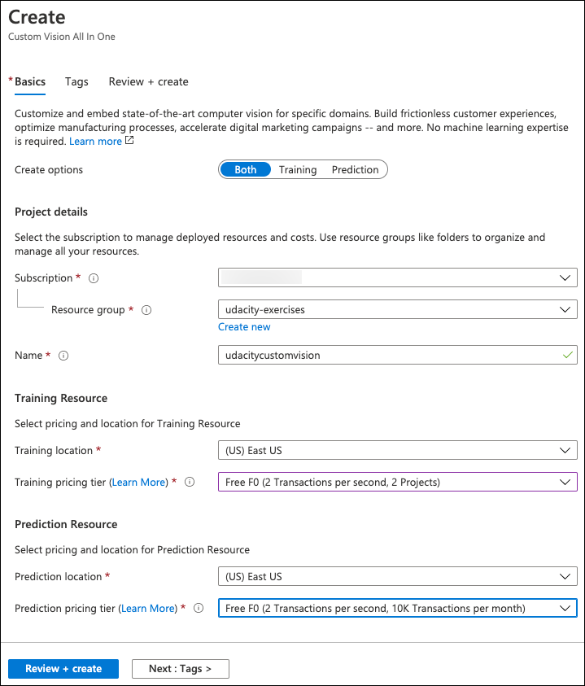

5. Select **Review + create** and, as you did previously, ensure the validation passed and then select **Create**.

## Task 4: Create an Azure Machine Learning workspace

In this task, you create an Azure Machine Learning workspace to provide an environment capable of hosting and running Jupyter notebooks. In the exercises, you will use Python code in Jupyter notebooks to consume the various Computer Vision services.

1. Return to the `udacity-exercises` resource group blade in the Azure portal and on the **Resource group** blade, select **Add** on the toolbar.

    

2. On the New blade, enter `Machine Learning` into the search the marketplace box, and press enter on your keyboard.

    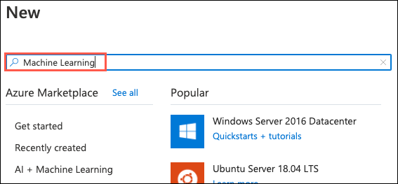

3. Select **Create** on the Machine Learning blade.

    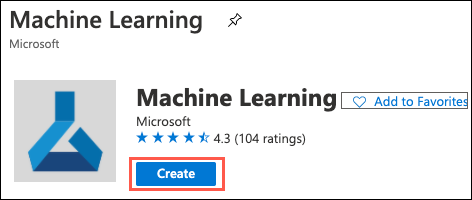

4. On the Create a machine learning workspace **Basics** tab, enter the following:

    - **Subscription**: Select the subscription you are using for this exercise.
    - **Resource group**: Select the resource group you created for this exercise.
    - **Workspace name**: Enter `udacity-ml-workspace`.
    - **Region**: Select the region you used for your resource group above.
    - **Storage account**: Accept the default assigned value to create a new storage account.
    - **Key vault**: Accept the default assigned value to create a new key vault.
    - **Application insights**: Accept the default assigned value to create a new Applications Insights instance.
    - **Container registry**: Accept the default assigned value of **None**.

    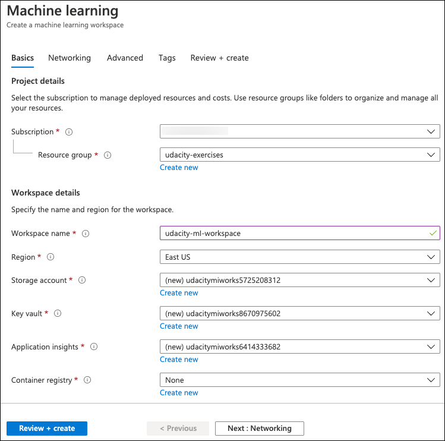

5. Select **Review + create**, ensure you see the validation passed message, and then select **Create**.

## Task 5: Create a compute instance

In this task, you create the virtual machine in your Azure Machine Learning workspace that will host the Jupyter environment for running Jupyter notebooks.

1. Once the AML workspace deployment completes, open [Azure Machine Learning Studio](https://ml.azure.com/) in a new browser window.

    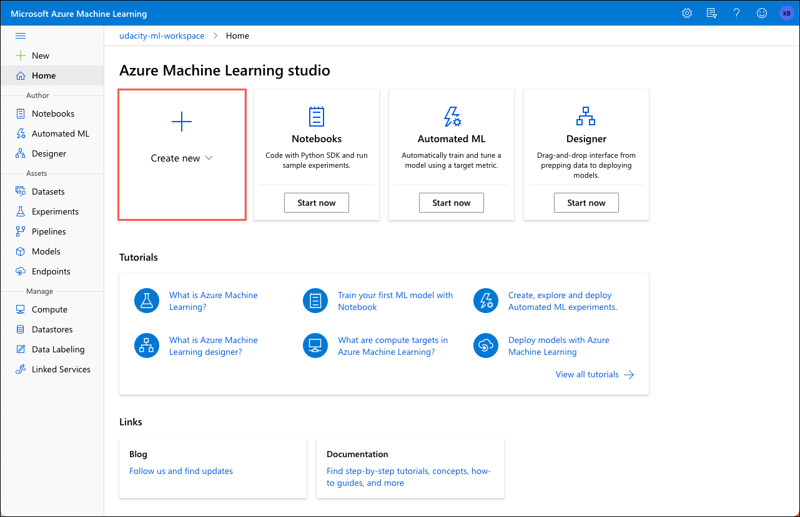

2. On the home page on Azure Machine Learning studio, select **Create new** and then select **Compute instance** from the context menu.

    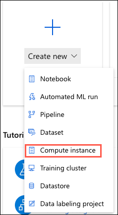

3. On the **Create compute instance** Virtual machine page, select the following:

    - **Virtual machine type**: Choose **CPU**.
    - **Virtual machine size**: Choose the `Standard_DS3_v2` virtual machine.

    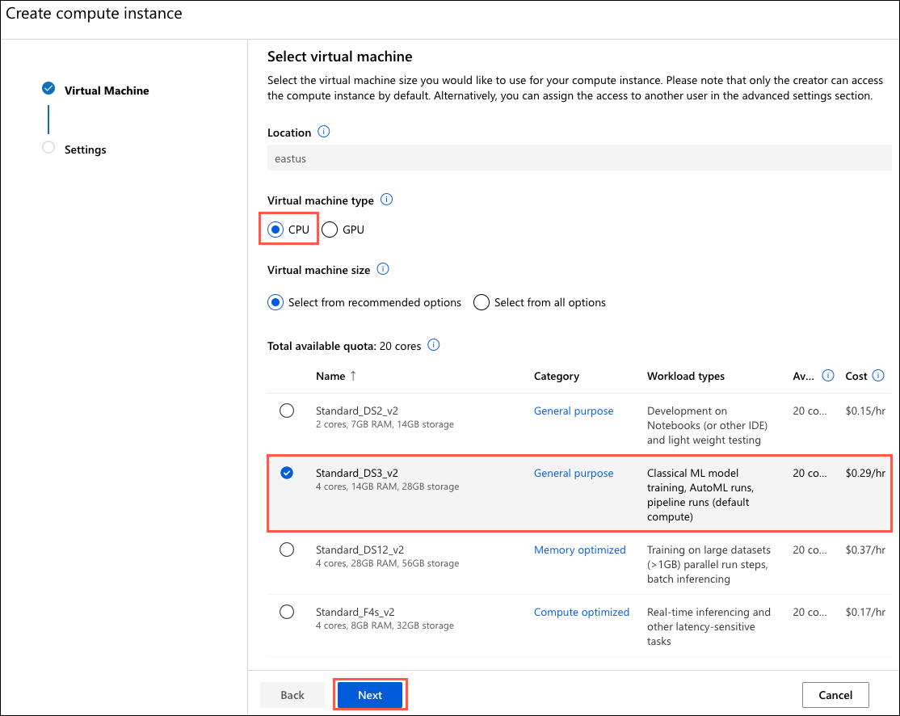

4. Select **Next** on the Create compute instance dialog.

5. Enter `udacity-ml-vm` for the **Compute name** and then select **Create**.

    > **Note**: It takes a few minutes for the compute instance to start, so wait until it has completed.

    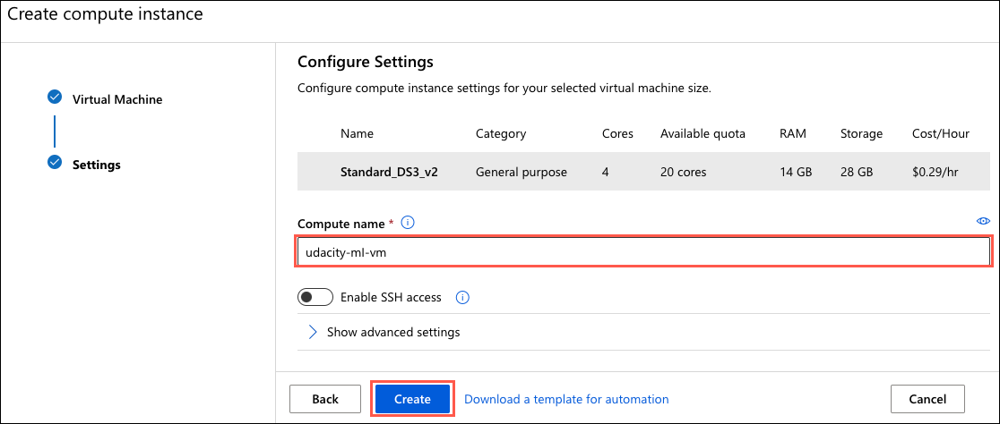

## Task 6: Clone the AI Fundamentals GitHub repo on your compute instance

In this task, you will launch the Jupyter environment running on your AML compute instance and clone the Udacity AI Fundamentals GitHub repo, which contains the Jupyter notebooks you will run in this lesson's exercises.

1. Launch the `Jupyter` interface for your compute instance by selecting the `Jupyter` Application URI associated with it.

    

2. In the Jupyter environment, select **New** and **Terminal** to open a terminal window.

    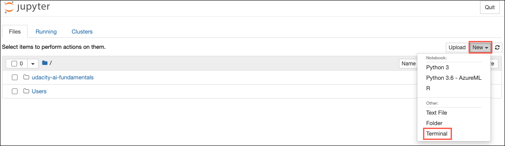

3. At the prompt, clone the Udacity AI Fundamentals GitHub repo containing the notebook for this exercise by pasting and executing the following code:

    ```bash
    git clone https://github.com/udacity/AI_fundamentals.git
    ```

4. When the cloning process finishes, close the terminal window and return to the Jupyter environment window. You should now see a folder named `AI_fundamentals`. This folder contains all of the notebooks and image files you will need to complete the exercises in this lesson.

    > **Note**, you may need to hit refresh on the window to see the `AI_fundamentals` folder.

    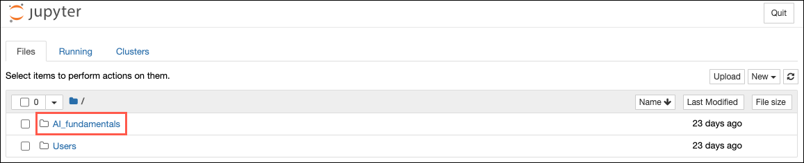

**This concludes the setup process for the exercises in this lesson.**
